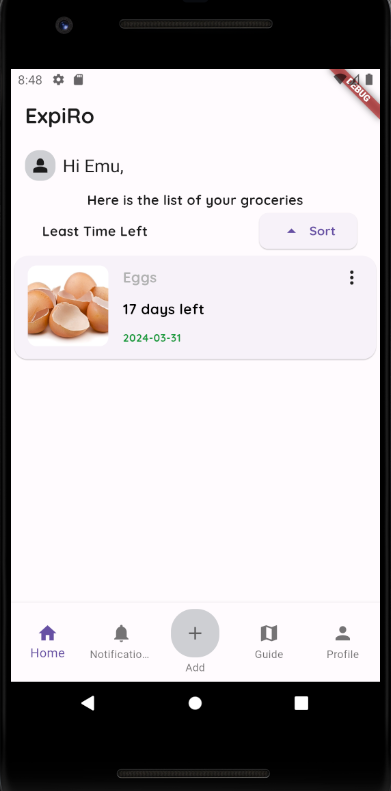

# ExpiRo

ExpiRo is a revolutionary mobile application aimed at reducing food waste by helping users keep track of their food's expiration dates and providing timely reminders. With ExpiRo, users can effectively manage their food inventory, minimize waste, and contribute to a more sustainable future.

## Table of Contents

- [Introduction](#introduction)
- [Features](#features)
- [Tech Stack](#tech-stack)
- [Team Members](#team-members)
- [Installation](#installation)
- [Usage](#usage)
- [Contributing](#contributing)
- [License](#license)

## Introduction

ExpiRo addresses the global issue of food waste by providing users with a simple yet powerful tool to manage their food inventory. With the app's intuitive interface and comprehensive features, users can easily add, track, and monitor their food items, receive timely notifications before they expire, and access valuable resources on food recycling and sustainability.

## Features

- **Inventory Management:** Keep track of all your food items with ease, including their names, expiration dates, and photos.
- **Item Scanning:** Use your device's camera to scan food items, automatically filling in their expiration dates and adding them to your inventory.
- **Notification System:** Receive timely reminders before your food items expire, ensuring you never waste another meal.
- **Guidance on Food Recycling:** Access helpful tips and resources on how to recycle food scraps and reduce waste.
- **User Profile:** Customize your experience and track your progress in reducing food waste.
  
## Tech Stack

ExpiRo is built using the following technologies:

- **Flutter:** A cross-platform framework for building mobile applications.
- **Dart:** The programming language used for developing Flutter applications.
- **GitHub:** Version control and collaboration platform for managing the project's codebase.
- **CSV:** File format utilized for efficient saving and loading of data within the app.

## Team Members

We would like to acknowledge and thank the following team members for their contributions to the ExpiRo project:

- **Bibhu Lamichhane** 
- **Riva Kansakar** 
- **Quinxie Doan** 
- **Drishtant Bhandari** 

## Installation

To install ExpiRo on your mobile device, follow these steps:

1. Clone the repository to your local machine: git clone 

2. Navigate to the project directory: cd ExpiRo

3. Install dependencies using Flutter: flutter pub get
   
4. Run the app on your preferred device: flutter run
   
## Usage

Once installed, launch the ExpiRo app on your mobile device. You'll be greeted with the home page displaying your food inventory. From there, you can easily add new food items, set reminders, access the guide page for food recycling tips, and customize your profile settings.

## Contributing

We welcome contributions from the community to help improve ExpiRo. To contribute, please follow these guidelines:

1. Fork the repository.
2. Create a new branch for your feature or bug fix.
3. Make your changes and ensure they adhere to the project's coding style and conventions.
4. Test your changes thoroughly.
5. Submit a pull request with a clear description of your changes and their rationale.

## License

ExpiRo is licensed under the [MIT License](LICENSE), which allows for both personal and commercial use. See the [LICENSE](LICENSE) file for more details.

   

